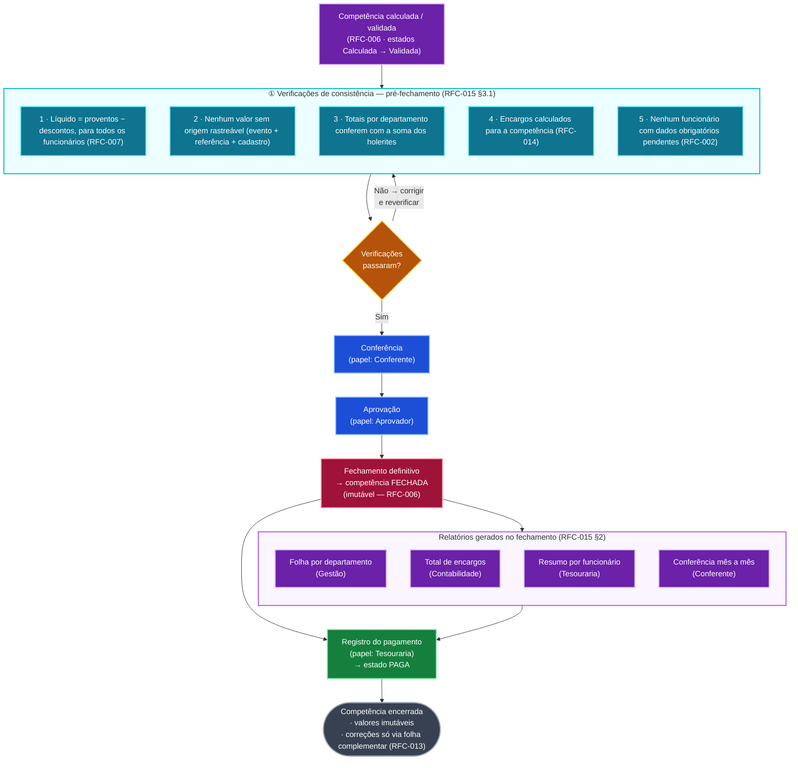

# RFC-015 — Diagrama do Fluxo de Fechamento da Competência

> Diagrama do **fluxo de fechamento** da competência (RFC-015 §3), da entrada
> (competência calculada/validada) até o registro do pagamento e a competência
> encerrada — com os papéis do RFC-009 nas transições e os relatórios do
> RFC-015 §2 gerados no fechamento.
> **Diagrama validado** com a engine Mermaid v10.9.1 (renderização confirmada
> no navegador, sem erros de sintaxe).

---

## 1. Diagrama (Mermaid flowchart)

````markdown

````

---

## 2. Legenda (cores)

| Cor | Significado | Nós |
|---|---|---|
| 🟣 **Roxo** | **Entrada** — competência já calculada/validada (RFC-006) | CALC |
| 🔵 **Azul-ciano** | **Verificações de consistência** pré-fechamento (RFC-015 §3.1) | V1–V5 |
| 🟠 **Âmbar** | **Decisão** — verificações passaram? | DEC |
| 🔵 **Azul** | **Etapas do fechamento** com papel dono (RFC-009) | CONF, APROV |
| 🔴 **Vermelho** | **Fechamento definitivo** — estado FECHADA, imutável | FECH |
| 🟢 **Verde** | **Registro do pagamento** — estado PAGA (Tesouraria) | PAGA |
| 🟣 **Roxo (relatórios)** | **Relatórios** gerados no fechamento (RFC-015 §2) — mesmo tom da entrada, diferenciados pelo subgraph | R1–R4 |
| ⚫ **Cinza** | **Fim** — competência encerrada, valores imutáveis | FIM |

> Os **subgraphs** têm fundos em tons claros para agrupar os nós: `VERIF` em
> ciano claro (`#ecfeff`) e `RELAT` em roxo claro (`#faf5ff`).

---

## 3. Referência Cruzada ao RFC-015

| Elemento do diagrama | Fonte no RFC-015 |
|---|---|
| Entrada (Calculada → Validada) | §1 + decisão 4 (§5) — fechamento só com validação prévia (estados sequenciais do RFC-006) |
| 5 verificações de consistência | §3.1 (itens 1–5) |
| Decisão "Não → corrigir e reverificar" | §3.1 — verificações são pré-fechamento |
| Conferência (Conferente) | §3.2, etapa 1 (papel: RFC-009) |
| Aprovação (Aprovador) | §3.2, etapa 2 |
| Fechamento definitivo → FECHADA (imutável) | §3.2, etapa 3 + regra 4 (§4) |
| Relatórios (R1–R4) | §2 — tabela dos 4 relatórios da 1ª versão |
| Registro do pagamento (Tesouraria → PAGA) | §3.2, etapa 4 |
| Competência encerrada / correções via RFC-013 | §4, regra 4 |

### Notas de fidelidade

1. **Ordem "relatórios antes do pagamento"** — o RFC-015 não explicita essa
   posição; ela vem do RFC-006 §3.3 (passo 16: gerar holerites/relatórios
   antes de registrar o pagamento). Fica registrado para não parecer invenção
   do diagrama.
2. **Papéis nas transições** — Conferente, Aprovador e Tesouraria vêm do
   RFC-009 (separação de funções: Aprovador ≠ Operador).
3. **Status do RFC-015** — está como **Draft (em revisão)** (v1.0.0); o fluxo
   reflete o documento atual.

---

*Diagrama validado com Mermaid v10.9.1 — sem erros de sintaxe. Gerado em
01/08/2026 a partir do RFC-015 (v1.0.0).*
